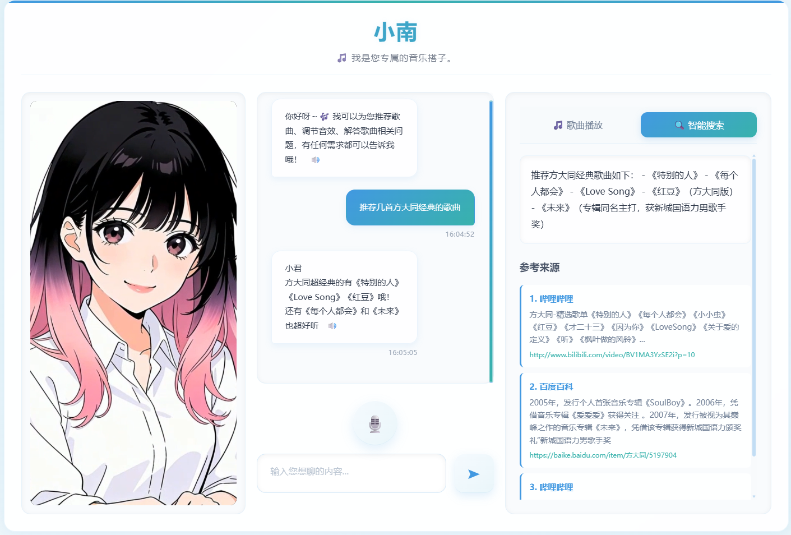
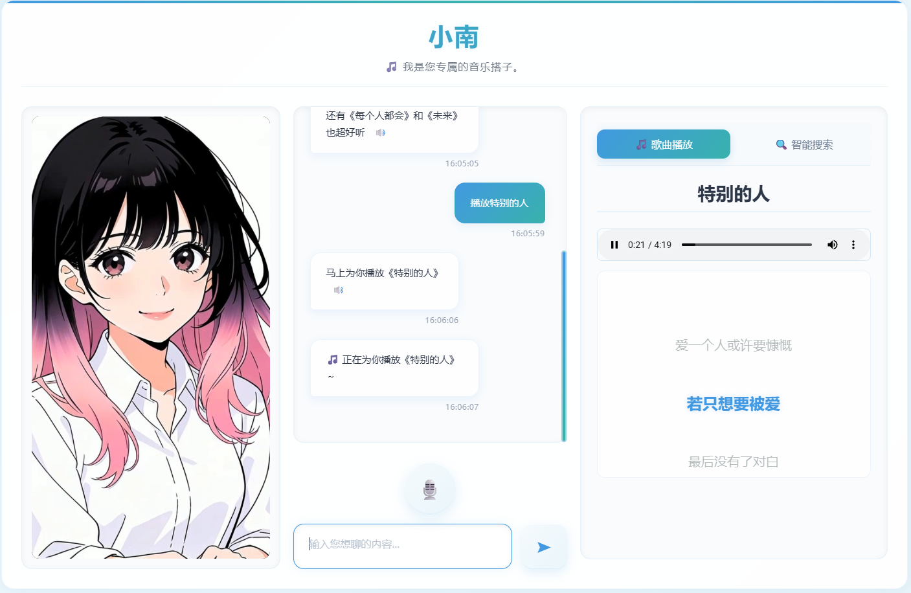
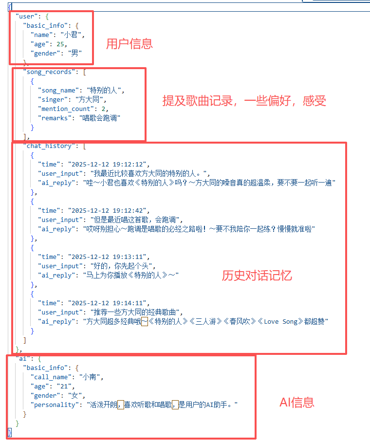
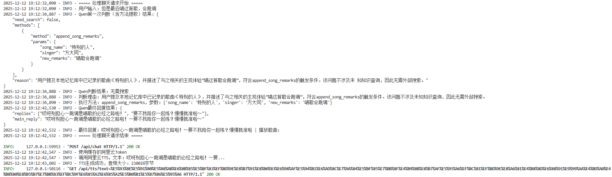
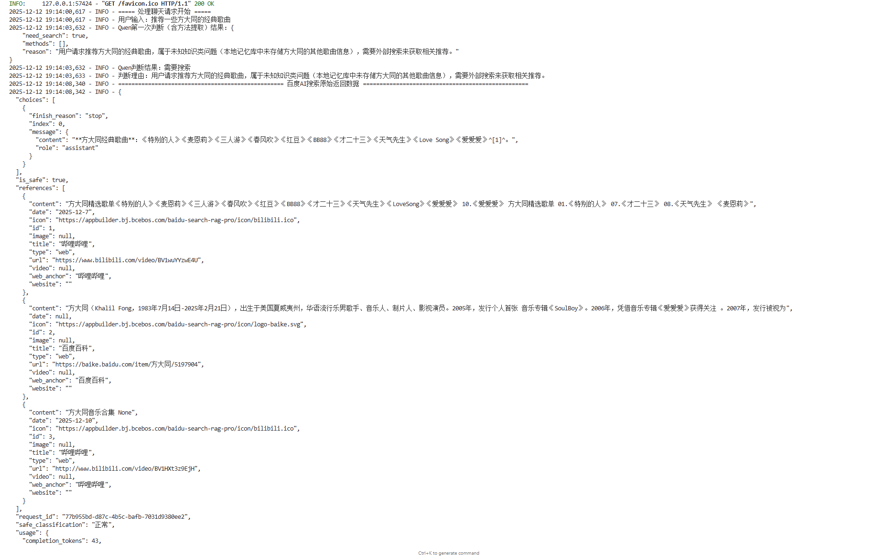
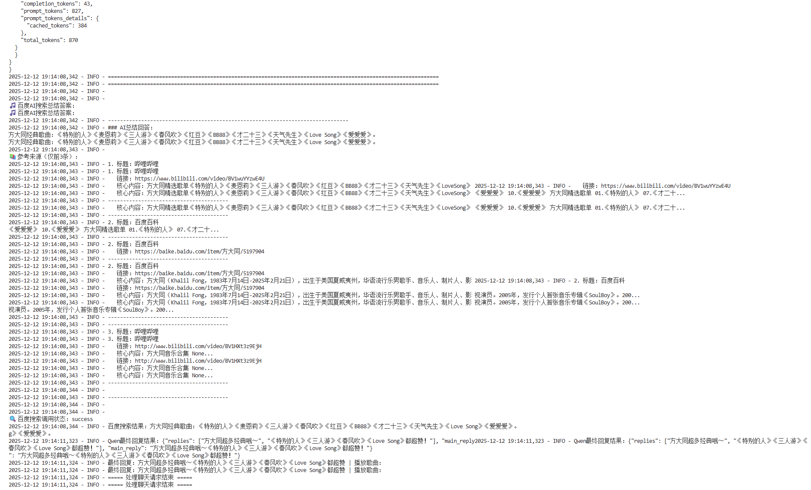

# Jiangnan_AI

## 开发日志  
### 2025.12.08  
完成项目整体构思，确定核心技术栈（Qwen3-max + 阿里云 ASR/TTS + 即梦 AI 虚拟形象）  
明确核心功能边界：语音交互、歌曲点播、虚拟形象联动  
### 2025.12.09  
完成前后端基础结构搭建，实现文字交互功能  
设计 Prompt 结构，支持大模型返回功能函数调用指令  
实现 data.json 数据存储与读写  
### 2025.12.10  
集成阿里云 ASR/TTS，完成智能语音交互功能  
实现虚拟人物动作与语音交互的联动  
优化 Prompt 结构，完善意图识别与函数调用逻辑  
完成歌词同步显示功能   
### 2025.12.11   
优化prompt的决策机制，意图识别。  
集成百度千帆智能搜索。  
针对模型对专有知识掌握不充分，幻觉等问题进行检索，追加专有只是内容。  
优化前端页面的显示，右侧新增智能检索展示，以及相关资料的网址。  
### 2025.12.12
修改微调了部分bug，优化丰富了一下prompt的逻辑。  
对整体的功能进行了详细的测试，并录制相关的视频。  
未完待续~~  

## 功能图示  

### 智能检索展示  
  

### 歌曲播放功能  
  

### AI记忆结构  
  

### AI决策逻辑1  
  

### AI决策逻辑2  
  
  

### AI决策逻辑2  
一句提问可执行多个方法，聊天记忆，词语接龙，对于未知知识，调用百度千帆智能搜索做一个简单的知识增强。可分析并进行用户的语义理解，具体演示视频如下：  
【小南AI】 https://www.bilibili.com/video/BV1EvmmBDEQC/?share_source=copy_web&vd_source=ace1240da2eff55045f9c97fb083b053  

## 项目介绍  
小南 AI 助手是一款面向多场景的智能交互系统，集成阿里云 ASR/TTS 语音能力、通义千问（Qwen3-max）大模型、虚拟形象交互和歌曲播放功能，实现了语音 / 文字双模态交互、百度AI智能检索（含参考来源展示）、智能歌曲点播、歌词实时同步、虚拟形象动作联动、用户/AI人设自定义、搜索结果可视化展示等核心特性，为用户提供沉浸式的智能陪伴体验。

🎙️ 智能语音交互：基于阿里云 ASR/TTS 实现语音识别与合成，支持全程语音对话  
🧠 大模型驱动：集成 Qwen3-max 大模型，精准理解用户意图（歌曲点播 / 信息修改 / 闲聊）  
🎭 虚拟形象交互：即梦 AI 生成的虚拟形象动作，随语音交互实时切换状态  
🎶 歌曲播放系统：支持音频播放、LRC 歌词解析、实时歌词同步显示  
💾 交互记忆：通过 data.json 持久化存储用户聊天记录、歌曲偏好、AI 人设信息  
🎨 精美 UI：响应式布局，磨砂质感设计，沉浸式交互体验  
🔍 智能知识检索：集成百度AI搜索能力，针对歌曲/歌手/歌词等知识类问题自动检索全网信息，返回精准答案并展示参考来源，支持搜索结果与聊天面板联动切换  
👤 人设自定义：支持用户修改自身基础信息（姓名/年龄/性别），也可自定义AI助手的称呼、性格、年龄等人设特征，交互记忆持久化存储  
📊 多面板交互：前端分虚拟形象面板、聊天面板、多功能右侧面板（歌曲播放/搜索结果双标签切换），支持内容可视化与沉浸式交互  

Jiangnan-AI/  
├── backend.py          # 后端核心代码（FastAPI服务，含百度AI搜索/人设管理/方法执行逻辑）  
├── frontend.html       # 前端页面（交互界面，含双标签面板/搜索结果展示/歌词三行同步）  
├── data.json           # 基础信息与交互记忆存储（用户信息/AI人设/聊天记录/歌曲记录）  
├── music/              # 歌曲与歌词文件目录  
│   ├── 歌曲名.mp3/aac  # 音频文件  
│   └── 歌曲名_歌词.lrc # 歌词文件  
├── xiaonan/            # 虚拟形象资源目录  
│   ├── xiaonannormal.mp4  # 正常状态视频  
│   └── xiaonantalking.mp4 # 说话状态视频  
└── README.md           # 项目说明文档  

技术栈  
后端  
框架：FastAPI（高性能 API 服务）  
大模型：通义千问 Qwen3-max  
语音能力：阿里云 ASR（语音识别）、阿里云 TTS（语音合成）  
部署：uvicorn   
数据存储：JSON 文件（data.json）  
检索能力：百度AI搜索API（qianfan）  
方法调度：基于Qwen大模型的意图提取与方法执行框架（update_user_info/update_ai_info等）  
数据处理：正则表达式（文本清洗/歌词解析）、JSON数据持久化  
其他：requests（HTTP 请求）、pydantic（数据校验）、logging（日志）  
前端  
基础：HTML5 + CSS3 + JavaScript  
交互：原生 JS（音频 / 视频控制、API 调用）  
样式：CSS3 渐变、磨砂玻璃效果、动画过渡  
功能：录音（MediaRecorder）、音频解析（AudioContext）、歌词同步  
交互增强：标签页切换（歌曲播放/搜索结果）、搜索结果可视化（参考来源超链接）  
用户体验：磨砂玻璃UI组件、录音状态动效、权限请求提示  
资源  
虚拟形象：即梦 AI 生成的动作视频  
音频：AAC/MP3 格式歌曲文件  
歌词：LRC 格式歌词文件  
快速开始  
环境要求  
Python 3.8+  
依赖库：见后端代码导入（fastapi、uvicorn、requests、aliyunsdkcore 等）  

核心功能使用  
 1. 文字交互  
- 在输入框中输入文字（如："播放一首特别的你"、"修改你的性格为活泼开朗"）  
- 点击发送按钮或按回车键提交  
- AI 会根据意图回复，并执行对应操作（点播歌曲 / 修改人设 / 闲聊）  
 2. 语音交互  
- 点击麦克风按钮开始录音  
- 说出指令（如："播放周杰伦的七里香"、"你好呀"）  
- 再次点击按钮结束录音，系统自动识别并响应  
 3. 歌曲播放   
- 语音 / 文字点播歌曲后，右侧面板显示歌曲信息、音频播放器和歌词
- 歌词采用三行同步模式（当前行高亮+上下行淡显），随音频进度精准切换
- 播放结束后自动提示，可点播下一首
- 支持模糊匹配歌曲名
 4. 虚拟形象交互  
- AI 回复时，虚拟形象自动切换为 "说话状态"  
- 回复结束后，自动切换回 "正常状态"  
 5. 智能搜索交互
- 输入/说出知识类问题（如："特别的人这首歌的原唱是谁"、"周杰伦七里香发行时间"）  
- 系统自动调用百度AI搜索获取答案，右侧面板自动切换到「智能搜索」标签  
- 查看AI总结的简洁答案，以及标注来源的参考信息（支持点击链接跳转原文）  
- 可随时切换回「歌曲播放」标签继续点播歌曲
 
功能亮点  
1. 意图驱动的方法执行：基于Qwen大模型提取用户意图，自动执行对应方法（update_user_info/append_song_remarks等），支持多意图顺序执行  
2. 智能搜索触发策略：精准判断何时需要调用百度AI搜索（知识类问题），何时仅本地处理（功能类操作），减少不必要的API调用  
3. 歌词同步优化：采用三行固定显示+定时更新策略，兼顾视觉体验和性能，支持多种LRC歌词格式  
4. 前端性能优化：录音数据转换为16位PCM格式，适配阿里云ASR接口；音频解析采用AudioContext，保证跨浏览器兼容性  
5. 数据持久化设计：用户/AI信息、聊天记录、歌曲偏好全部持久化存储，支持数据自动恢复（文件损坏时重新初始化）  

后续计划  
- 优化大模型 Prompt，提升意图识别准确率  
- 新增歌曲推荐功能（基于用户播放记录）  
- 丰富虚拟形象动作，支持更多情绪状态  
- 优化前端界面，支持移动端适配  
- 增加音效调节、歌曲收藏等功能  
- 优化百度AI搜索结果解析，支持更多资源类型（百科/视频/音乐）  
- 新增搜索结果缓存机制，减少重复API调用  
- 完善人设系统，支持更多性格特征和回复风格定制  
- 优化歌词解析，支持更多LRC格式变体（如带偏移量的歌词）  
- 增加搜索结果导出、歌曲播放列表管理功能  

许可证  
本项目为个人开发项目，仅供学习交流使用。  

联系方式  
如有问题或建议，欢迎提 Issue 或联系作者。  
未完待续，持续迭代中... 🚀  
